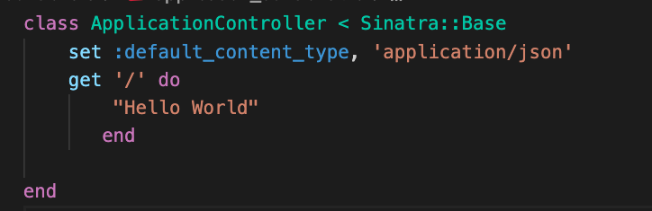
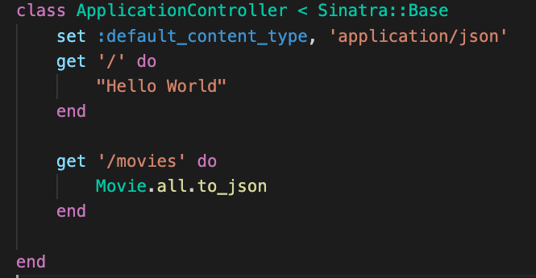
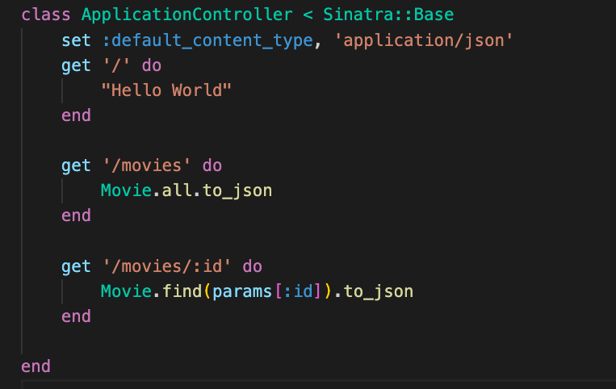

# Activity

# Deliverables
Create sinatra routes 

>Note: if you get stuck review Sinatra with Active Record: POST/PATCH/DELETE Requests
>Note: `bundle exec rerun -b 'rackup config.ru'` will run your server.

0. Bundle, migrate and seed

1. In the controller folder create `application_controller.rb`. Create a `ApplicationController` class that inherits from `Sinatra::Base`. Set the default content type to 'application/json'. Add a '/' get route that returns `hello world`. Start your server and verify that `http://localhost:9292/` returns `hello world` in the browser.
 

      

        solution 
      

      

        
      

 

2. Create a `movies` get route that returns all of the movies in the db.

 

      

        solution 
      

      

        
      

 

3. Create a dynamic route that will pull one movie from the db and send it to the browser.  
> Hint: You'll need the params hash for this. Take a moment to discuss the params hash with your group.
 

      

        solution 
      

      

        
      

 

### Bonus 
4. Create a get all tickets route  

5. Create a get one ticket route 